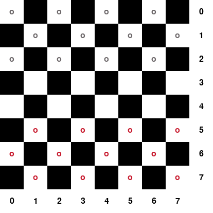

# Checkers AI with Monte Carlo Tree Search  

This repository contains the code for playing checkers using Monte-Carlo-Tree-Search (MCTS). The rules for the game were selected to conform to those of English Draughts (https://en.wikipedia.org/wiki/English_draughts). 

The package contains the code for:
* Simulating the board
* Training the MCTS agent
* Playing the MCTS agent against a random player
* Playing the MCTS agent against a human player

Here is an example of the MCTS performance after training on only 50 games of self play:

MCTS (Red) vs. Random Player (Gray)    |  MCTS (Red) vs. Human Player (Gray)
:-------------------------------------:|:--------------------------------:
       |     

## Installation

```
conda create --name myenv python=3.7 
conda activate myenv
git clone https://github.com/hemerson1/MCTS-Checkers.git
cd RLcycle
pip install -U -r requirements.txt
pip install -e .
```

## Reference

This project is an extension of the work performed at the 2021 Reinforcement Learning Summer School at the Turing Institute (https://www.turing.ac.uk/). 


## Licence

[MIT](https://choosealicense.com/licenses/mit/)
